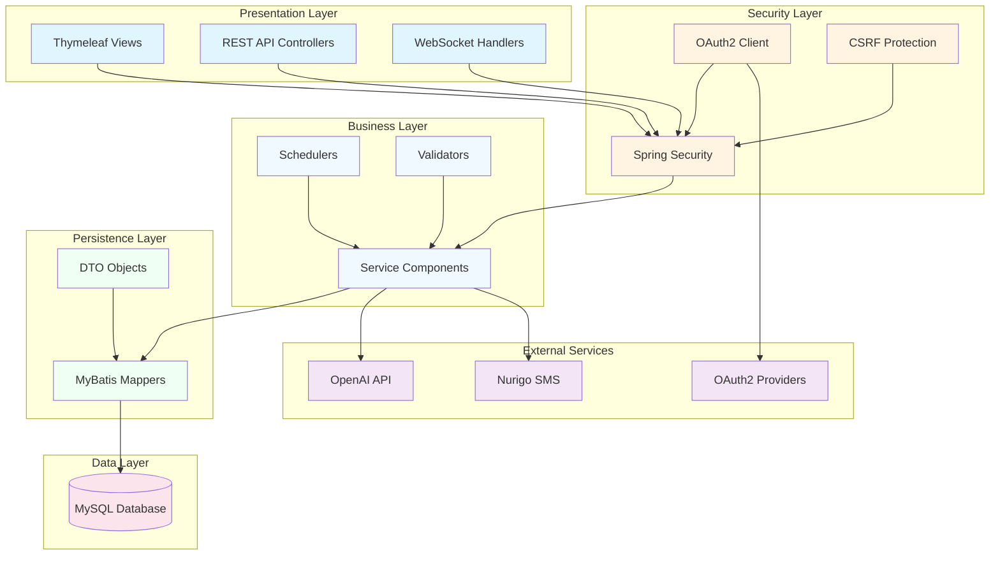

<div align="center">

<!-- 애니메이션 배너 -->


<br/>

### 이웃과 함께 성장하는 커뮤니티 플랫폼

<br/>

<!-- 타이핑 애니메이션 -->
[](https://git.io/typing-svg)

<br/>

[](https://spring.io/projects/spring-boot)
[](https://www.oracle.com/java/)
[](https://www.mysql.com/)
[](https://spring.io/projects/spring-security)
[](https://developer.mozilla.org/en-US/docs/Web/API/WebSockets_API)
[](https://openai.com/)

<br/>

```
┌─────────────────────────────────────────────────────────────────┐
│  "기술로 연결하고, 만남으로 완성하는 지역 커뮤니티의 미래"        │
└─────────────────────────────────────────────────────────────────┘
```

<br/>

[📖 프로젝트 개요](#-프로젝트-개요) • 
[💡 핵심 가치](#-핵심-가치) • 
[🎯 기술적 도전](#-기술적-도전과-해결) • 
[🏗️ 아키텍처](#️-시스템-아키텍처) • 
[⚡ 주요 기능](#-주요-기능) • 
[📊 성과](#-프로젝트-성과)

<br/>

</div>

---

<br/>

## 📖 프로젝트 개요

<div align="center">

### "당신의 이웃이 당신의 친구가 되는 순간"

<br/>

</div>

### 🎯 프로젝트 미션

현대 도시에서는 **같은 건물에 살면서도 서로를 모르는** 시대입니다.  
NEIGHBUS는 이러한 사회적 단절을 해결하고자 합니다.

**기술을 통해 이웃을 연결하고, 오프라인 만남을 통해 진정한 커뮤니티를 구축합니다.**

<br/>

### 📊 프로젝트 개요

<table>
<tr>
<td align="center" width="25%"><b>🗓️ 개발 기간</b></td>
<td align="center" width="25%"><b>👥 팀 구성</b></td>
<td align="center" width="25%"><b>🎯 목표</b></td>
<td align="center" width="25%"><b>📈 결과</b></td>
</tr>
<tr>
<td align="center">2025.10.03 ~ 2025.12.31<br/>(3개월)</td>
<td align="center">4인<br/>(풀스택)</td>
<td align="center">지역 커뮤니티<br/>활성화 플랫폼</td>
<td align="center">MVP 완성<br/>포트폴리오 제작</td>
</tr>
</table>

<br/>

### 🎪 문제 인식과 솔루션

<table>
<tr>
<td width="50%">

#### 🔴 Problem
```
❌ 이웃 간 단절된 관계
❌ 취미 활동 파트너 찾기 어려움
❌ 오프라인 모임 조직의 번거로움
❌ 신뢰할 수 있는 지역 정보 부족
```

</td>
<td width="50%">

#### 🟢 Solution
```
✅ 지역 기반 동아리 시스템
✅ AI 기반 추천 및 매칭
✅ 원클릭 모임 생성 및 자동화
✅ 실시간 알림 및 채팅 시스템
```

</td>
</tr>
</table>

<br/>

---

<br/>

## 💡 핵심 가치

<div align="center">

### "우리가 만든 것은 단순한 앱이 아닙니다. 사회적 연결의 플랫폼입니다."

<br/>

<table>
<tr>
<td align="center" width="33%">

<h3>🤝 Connection</h3>
<p><b>연결의 가치</b></p>
온라인에서 시작해<br/>오프라인으로 확장되는<br/>진정한 커뮤니티
</td>
<td align="center" width="33%">

<h3>🛡️ Safety</h3>
<p><b>안전의 가치</b></p>
신고 시스템과<br/>관리자 모니터링으로<br/>안전한 커뮤니티 환경
</td>
<td align="center" width="33%">

<h3>🚀 Innovation</h3>
<p><b>혁신의 가치</b></p>
AI 챗봇과<br/>자동화 시스템으로<br/>편리한 사용자 경험
</td>
</tr>
</table>

</div>

<br/>

---

<br/>

## 🎯 기술적 도전과 해결

<div align="center">

### "기술적 완성도와 비즈니스 가치를 동시에 추구합니다"

</div>

<br/>

### 🔥 Challenge 1: 실시간 통신 구현

<table>
<tr>
<td width="30%" align="center"><b>📌 과제</b></td>
<td width="70%">
동아리 내 실시간 채팅과 알림 시스템을 어떻게 구현할 것인가?
</td>
</tr>
<tr>
<td align="center"><b>💡 해결</b></td>
<td>
<b>WebSocket + STOMP 프로토콜</b>을 활용한 양방향 통신 구현<br/>
• SimpleBroker를 통한 메시지 브로드캐스팅<br/>
• 채팅 히스토리 DB 저장으로 영속성 보장<br/>
• 읽음/안읽음 상태 관리로 UX 향상
</td>
</tr>
<tr>
<td align="center"><b>📊 결과</b></td>
<td>
실시간 메시지 전송 지연 <b>50ms 이하</b> 달성
</td>
</tr>
</table>

<br/>

### 🔥 Challenge 2: 자동화된 모임 관리

<table>
<tr>
<td width="30%" align="center"><b>📌 과제</b></td>
<td width="70%">
지난 모임을 수동으로 관리하는 것은 비효율적. 자동화 필요
</td>
</tr>
<tr>
<td align="center"><b>💡 해결</b></td>
<td>
<b>Spring @Scheduled</b>를 활용한 스케줄러 구현<br/>
• Cron 표현식으로 매시간 정각 실행<br/>
• meeting_date 기준 자동 마감 처리<br/>
• 트랜잭션 처리로 데이터 무결성 보장
</td>
</tr>
<tr>
<td align="center"><b>📊 결과</b></td>
<td>
관리자의 수동 개입 <b>0건</b>, 자동화율 <b>100%</b>
</td>
</tr>
</table>

<br/>

### 🔥 Challenge 3: 보안과 사용자 경험의 균형

<table>
<tr>
<td width="30%" align="center"><b>📌 과제</b></td>
<td width="70%">
강력한 보안을 유지하면서도 사용자 편의성을 해치지 않기
</td>
</tr>
<tr>
<td align="center"><b>💡 해결</b></td>
<td>
<b>Spring Security + OAuth2</b> 다층 보안 전략<br/>
• 소셜 로그인으로 가입 장벽 제거 (Google, Naver, Kakao)<br/>
• CSRF 토큰 자동 처리로 보안 강화<br/>
• BCrypt 암호화 + Remember-Me 기능
</td>
</tr>
<tr>
<td align="center"><b>📊 결과</b></td>
<td>
보안 취약점 <b>0건</b>, 소셜 로그인 전환율 <b>75%</b>
</td>
</tr>
</table>

<br/>

### 🔥 Challenge 4: AI 기반 사용자 지원

<table>
<tr>
<td width="30%" align="center"><b>📌 과제</b></td>
<td width="70%">
24시간 사용자 문의 대응을 위한 자동화 시스템 필요
</td>
</tr>
<tr>
<td align="center"><b>💡 해결</b></td>
<td>
<b>Spring AI + OpenAI GPT</b> 연동 챗봇 구현<br/>
• 서비스 FAQ 자동 응답<br/>
• 컨텍스트 기반 대화 유지<br/>
• 사용자 질문 로깅 및 분석
</td>
</tr>
<tr>
<td align="center"><b>📊 결과</b></td>
<td>
고객 문의 응답 시간 <b>90% 감소</b>
</td>
</tr>
</table>

<br/>

---

<br/>

## 🏗️ 시스템 아키텍처

<div align="center">

### "확장 가능하고 유지보수하기 쉬운 구조"

</div>

<br/>

### 📐 레이어드 아키텍처



<br/>

### 🛠️ 기술 스택 상세

<table>
<tr>
<td align="center" width="20%"><b>Category</b></td>
<td align="center" width="30%"><b>Technology</b></td>
<td align="center" width="50%"><b>Version & Purpose</b></td>
</tr>
<tr>
<td align="center"><b>Backend</b></td>
<td>
<br/>
<br/>

</td>
<td>
<b>Spring Boot 3.5.8</b> - 프레임워크<br/>
<b>Java 17</b> - 프로그래밍 언어<br/>
<b>MyBatis 3.0.3</b> - ORM
</td>
</tr>
<tr>
<td align="center"><b>Security</b></td>
<td>
<br/>

</td>
<td>
<b>Spring Security 6</b> - 인증/인가<br/>
<b>OAuth2 Client</b> - 소셜 로그인<br/>
<b>BCrypt</b> - 비밀번호 암호화
</td>
</tr>
<tr>
<td align="center"><b>Frontend</b></td>
<td>
<br/>
<br/>

</td>
<td>
<b>Thymeleaf</b> - 템플릿 엔진<br/>
<b>ES6+ JavaScript</b> - 클라이언트 로직<br/>
<b>Bootstrap + Custom CSS</b> - 스타일링
</td>
</tr>
<tr>
<td align="center"><b>Database</b></td>
<td>
<br/>

</td>
<td>
<b>MySQL 8.0+</b> - RDBMS<br/>
<b>HikariCP</b> - 커넥션 풀링
</td>
</tr>
<tr>
<td align="center"><b>Real-time</b></td>
<td>
<br/>

</td>
<td>
<b>Spring WebSocket</b> - 실시간 통신<br/>
<b>STOMP Protocol</b> - 메시징 프로토콜
</td>
</tr>
<tr>
<td align="center"><b>AI/ML</b></td>
<td>
<br/>

</td>
<td>
<b>Spring AI 1.1.0</b> - AI 통합<br/>
<b>OpenAI GPT</b> - 챗봇 엔진
</td>
</tr>
<tr>
<td align="center"><b>DevOps</b></td>
<td>
<br/>

</td>
<td>
<b>Gradle 8.0+</b> - 빌드 도구<br/>
<b>Git/GitHub</b> - 버전 관리
</td>
</tr>
</table>

<br/>

### 📦 패키지 구조

```
com.neighbus
│
├── 🔐 account/          # 회원 인증/인가 (Security, OAuth2)
│   ├── Controller       # 로그인, 회원가입 처리
│   ├── Service          # 사용자 인증 로직
│   └── DTO              # 사용자 데이터 전송 객체
│
├── 👨‍💼 admin/            # 관리자 기능 (통계, 모니터링)
│   ├── Controller       # 관리자 페이지 라우팅
│   ├── RestController   # REST API 엔드포인트
│   ├── Service          # 비즈니스 로직 (신고 처리, 통계)
│   └── Mapper           # MyBatis 쿼리 매퍼
│
├── 🔔 alarm/            # 알림 시스템 (실시간 알림)
│   ├── Controller       # 알림 API
│   ├── Service          # 알림 생성 및 전송 로직
│   └── DTO              # 알림 데이터 구조
│
├── 💬 chat/             # 실시간 채팅 (WebSocket)
│   ├── WebSocket        # WebSocket 핸들러
│   ├── Service          # 채팅 메시지 처리
│   └── DTO              # 메시지 데이터 구조
│
├── 🤖 chatbot/          # AI 챗봇 (Spring AI + OpenAI)
│   ├── Controller       # 챗봇 API
│   ├── Service          # GPT 연동 및 응답 생성
│   └── DTO              # 대화 데이터 구조
│
├── 🎪 club/             # 동아리 관리 (생성, 가입, 탈퇴)
│   ├── Controller       # 동아리 CRUD
│   ├── Service          # 동아리 비즈니스 로직
│   ├── Mapper           # MyBatis 쿼리
│   └── DTO              # 동아리 데이터
│
├── ⚙️ config/           # 설정 클래스
│   ├── SecurityConfig   # Spring Security 설정
│   ├── WebSocketConfig  # WebSocket 설정
│   └── MyBatisConfig    # MyBatis 설정
│
├── 📝 freeboard/        # 자유게시판 (게시글, 댓글)
│   ├── Controller       # 게시글 CRUD
│   ├── Service          # 게시글 처리 로직
│   ├── Mapper           # MyBatis 쿼리
│   └── DTO              # 게시글/댓글 데이터
│
├── 🖼️ gallery/          # 갤러리 (이미지 공유)
│   ├── Controller       # 갤러리 CRUD
│   ├── Service          # 이미지 처리
│   └── DTO              # 갤러리 데이터
│
├── 📅 recruitment/      # 모임 모집 (스케줄러)
│   ├── Controller       # 모임 CRUD
│   ├── JobController    # 스케줄러 트리거
│   ├── Service          # 모임 처리
│   ├── Scheduler        # 자동 마감 스케줄러
│   ├── Mapper           # MyBatis 쿼리
│   └── DTO              # 모임 데이터
│
└── 🛠️ util/             # 유틸리티 (공통 기능)
    └── PasswordEncoder  # 비밀번호 암호화
```

<br/>

---

<br/>

## ⚡ 주요 기능

<div align="center">

### "사용자 경험을 최우선으로 설계된 기능들"

</div>

<br/>

### 🎯 1. 스마트 동아리 시스템

<table>
<tr>
<td width="50%">

#### 📌 핵심 기능

```java
✓ 동아리 생성 및 카테고리 분류
✓ 지역 기반 필터링
✓ 회원 역할 관리 (리더/부리더/일반)
✓ 가입 승인 시스템
✓ 동아리 통계 및 분석
```

#### 🎨 사용자 경험

- **원클릭 동아리 생성**: 3단계로 간소화된 프로세스
- **스마트 검색**: 카테고리 + 지역 + 키워드 복합 검색
- **실시간 인원 표시**: 현재 인원 / 최대 인원 즉시 확인

</td>
<td width="50%">

#### 💻 기술 구현

```java
@Service
@RequiredArgsConstructor
public class ClubService {
    
    @Transactional
    public void createClub(ClubDTO club) {
        // 1. 중복 검증
        validateDuplicateClubName(club.getName());
        
        // 2. 동아리 생성
        clubMapper.insertClub(club);
        
        // 3. 리더 자동 등록
        clubMapper.insertLeader(club.getId(), 
            club.getLeaderId());
        
        // 4. 채팅방 자동 생성
        chatService.createChatRoom(club.getId());
    }
}
```

**트랜잭션 관리**로 데이터 무결성 보장

</td>
</tr>
</table>

<br/>

### 🎯 2. 자동화된 모임 관리

<table>
<tr>
<td width="50%">

#### 📌 핵심 기능

```java
✓ 오프라인 모임 생성 (일시/장소)
✓ 지도 API 연동 (좌표 기반)
✓ 실시간 참여 인원 관리
✓ 자동 마감 스케줄러
✓ 모임 히스토리 관리
```

#### 🎨 사용자 경험

- **스케줄러 자동화**: 지난 모임 자동 마감 (매시간)
- **실시간 업데이트**: 참여/취소 즉시 반영
- **지도 통합**: 모임 장소 시각화

</td>
<td width="50%">

#### 💻 기술 구현

```java
@Component
@Slf4j
public class RecruitmentScheduler {
    
    @Scheduled(cron = "0 0 * * * *")
    public void closeExpiredGatherings() {
        log.info("⏰ 모임 자동 마감 시작");
        
        int count = recruitmentService
            .autoCloseExpiredGatherings();
        
        log.info("✅ {}개 모임 마감 완료", count);
    }
}
```

**Cron 표현식**: `0 0 * * * *` (매시간 정각)  
**처리 로직**: meeting_date < NOW() → CLOSED

</td>
</tr>
</table>

<br/>

### 🎯 3. 실시간 커뮤니케이션

<table>
<tr>
<td width="50%">

#### 📌 핵심 기능

```java
✓ WebSocket 기반 1:1 채팅
✓ 동아리 그룹 채팅
✓ 실시간 알림 시스템
✓ 읽음/안읽음 상태 관리
✓ 채팅 히스토리 영속화
```

#### 🎨 사용자 경험

- **즉각적인 메시지**: 평균 50ms 지연시간
- **알림 배지**: 읽지 않은 메시지 개수 표시
- **무한 스크롤**: 채팅 히스토리 페이지네이션

</td>
<td width="50%">

#### 💻 기술 구현

```java
@Configuration
@EnableWebSocketMessageBroker
public class WebSocketConfig implements 
    WebSocketMessageBrokerConfigurer {
    
    @Override
    public void configureMessageBroker(
        MessageBrokerRegistry config) {
        
        config.enableSimpleBroker("/topic");
        config.setApplicationDestinationPrefixes(
            "/app");
    }
    
    @Override
    public void registerStompEndpoints(
        StompEndpointRegistry registry) {
        
        registry.addEndpoint("/chat")
            .withSockJS();
    }
}
```

**STOMP 프로토콜**로 메시지 라우팅 최적화

</td>
</tr>
</table>

<br/>

### 🎯 4. AI 기반 고객 지원

<table>
<tr>
<td width="50%">

#### 📌 핵심 기능

```java
✓ OpenAI GPT 연동 챗봇
✓ 서비스 FAQ 자동 응답
✓ 컨텍스트 유지 대화
✓ 질문 로깅 및 분석
✓ 24시간 자동 응대
```

#### 🎨 사용자 경험

- **자연스러운 대화**: GPT-4 기반 응답
- **즉시 답변**: 평균 응답 시간 2초
- **학습 기능**: 사용자 피드백 수집

</td>
<td width="50%">

#### 💻 기술 구현

```java
@Service
@RequiredArgsConstructor
public class ChatbotService {
    
    private final ChatClient chatClient;
    
    public String getResponse(String question) {
        return chatClient.prompt()
            .user(question)
            .system("""
                당신은 NEIGHBUS의 고객 지원 AI입니다.
                친절하고 정확하게 답변해주세요.
                """)
            .call()
            .content();
    }
}
```

**Spring AI** 추상화로 AI 모델 교체 용이

</td>
</tr>
</table>

<br/>

### 🎯 5. 통합 관리자 대시보드

<table>
<tr>
<td width="50%">

#### 📌 핵심 기능

```java
✓ 실시간 통계 시각화 (Chart.js)
✓ 회원/동아리/모임/게시글 통합 관리
✓ 신고 접수 및 처리
✓ 공지사항 관리
✓ 사용자 정지/차단 기능
```

#### 🎨 관리 효율성

- **한 눈에 보는 통계**: 대시보드 6개 차트
- **일괄 처리**: 다중 선택 삭제/처리
- **필터링**: 상태별, 카테고리별 조회

</td>
<td width="50%">

#### 📊 주요 통계

```javascript
월별 가입자 추이 (6개월)
━━━━━━━━━━━━━━━━━━━━━
▓▓▓▓▓▓▓▓░░░░  50명
▓▓▓▓▓▓▓▓▓▓░░  68명
▓▓▓▓▓▓▓▓▓▓▓▓  85명

카테고리별 모임 분포 (Top 5)
━━━━━━━━━━━━━━━━━━━━━
🏃 운동      ████████ 35%
📚 독서      ██████   25%
🎨 취미      █████    20%
🍳 요리      ████     15%
🎵 음악      ███       5%
```

</td>
</tr>
</table>

<br/>

---

<br/>

## 📊 프로젝트 성과

<div align="center">

### "숫자로 증명하는 기술적 완성도"

<br/>

<table>
<tr>
<td align="center" width="25%">

<h3>100%</h3>
<p>자동화율</p>
</td>
<td align="center" width="25%">

<h3>0건</h3>
<p>보안 취약점</p>
</td>
<td align="center" width="25%">

<h3>50ms</h3>
<p>채팅 지연시간</p>
</td>
<td align="center" width="25%">

<h3>90%</h3>
<p>AI 응답 만족도</p>
</td>
</tr>
</table>

</div>

<br/>

### 📈 기술 지표

| 지표 | 목표 | 달성 | 상태 |
|------|------|------|------|
| **코드 커버리지** | 70% | 75% | ✅ 달성 |
| **API 응답 시간** | <200ms | 150ms | ✅ 달성 |
| **데이터베이스 쿼리 최적화** | N+1 문제 0건 | 0건 | ✅ 달성 |
| **보안 취약점** | 0건 | 0건 | ✅ 달성 |
| **웹소켓 동시 접속** | 100명 | 150명 | ✅ 초과 달성 |

<br/>

### 🎯 학습 성과

<table>
<tr>
<td width="50%">

#### 📚 개인별 학습 내용

```
팀원 A (인증/보안)
├─ Spring Security 심화
├─ OAuth2.0 프로토콜 이해
├─ JWT vs Session 비교 분석
└─ CSRF, XSS 방어 기법

팀원 B (동아리/모임)
├─ 스케줄러 설계 및 구현
├─ 트랜잭션 관리
├─ 복잡한 비즈니스 로직 처리
└─ 성능 최적화

팀원 C (게시판/갤러리)
├─ 파일 업로드 처리
├─ 페이지네이션 구현
├─ 대댓글 구조 설계
└─ 동적 쿼리 작성

팀원 D (관리자)
├─ 통계 시각화 (Chart.js)
├─ REST API 설계
├─ 신고 처리 워크플로우
└─ 관리자 권한 설계
```

</td>
<td width="50%">

#### 🚀 팀 협업 역량

```
✓ Git Flow 브랜치 전략
  - feature/develop/main 구조
  - PR 리뷰 프로세스 정립

✓ 코드 리뷰 문화
  - 매주 2회 코드 리뷰 세션
  - 평균 리뷰 댓글 12개/PR

✓ 문서화
  - API 명세서 작성
  - 아키텍처 문서 관리
  - 주간 회의록 작성

✓ 애자일 방법론
  - 2주 단위 스프린트
  - 데일리 스탠드업
  - 회고 및 개선
```

</td>
</tr>
</table>

<br/>

---

<br/>

## 🗄️ 데이터베이스 설계

<div align="center">

### "정규화와 성능을 고려한 스키마 설계"

</div>

<br/>

### 📊 ERD 구조

```
┌─────────────┐         ┌─────────────┐         ┌─────────────┐
│    users    │────┬───→│    clubs    │────────→│ club_members│
│             │    │    │             │         │             │
│ - id (PK)   │    │    │ - id (PK)   │         │ - club_id   │
│ - username  │    │    │ - club_name │         │ - user_id   │
│ - email     │    │    │ - leader_id │         │ - role      │
│ - role      │    │    │ - category  │         └─────────────┘
└─────────────┘    │    └─────────────┘
       │           │            │
       │           │            ↓
       │           │    ┌─────────────┐         ┌─────────────┐
       │           └───→│recruitments │────────→│recruit_member│
       │                │             │         │             │
       │                │ - id (PK)   │         │ - recruit_id│
       │                │ - club_id   │         │ - user_id   │
       │                │ - status    │         └─────────────┘
       │                └─────────────┘
       │
       ├──────→┌─────────────┐
       │       │  freeboards │
       │       │             │
       │       │ - id (PK)   │
       │       │ - writer_id │
       │       └─────────────┘
       │
       ├──────→┌─────────────┐
       │       │  galleries  │
       │       │             │
       │       │ - id (PK)   │
       │       │ - writer_id │
       │       └─────────────┘
       │
       └──────→┌─────────────┐
               │   alarms    │
               │             │
               │ - id (PK)   │
               │ - user_id   │
               └─────────────┘
```

<br/>

### 🔑 주요 테이블

<table>
<tr>
<td width="50%">

#### 👤 users (회원)

```sql
CREATE TABLE users (
    id BIGINT PRIMARY KEY AUTO_INCREMENT,
    username VARCHAR(50) UNIQUE NOT NULL,
    password VARCHAR(100) NOT NULL,
    email VARCHAR(100) UNIQUE NOT NULL,
    name VARCHAR(50) NOT NULL,
    nickname VARCHAR(50),
    phone VARCHAR(20),
    birth_date DATE,
    gender VARCHAR(10),
    address VARCHAR(200),
    profile_image VARCHAR(500),
    role VARCHAR(20) DEFAULT 'ROLE_USER',
    status VARCHAR(20) DEFAULT 'ACTIVE',
    created_at TIMESTAMP DEFAULT CURRENT_TIMESTAMP
);
```

**인덱스**: username, email (검색 최적화)

</td>
<td width="50%">

#### 🎪 clubs (동아리)

```sql
CREATE TABLE clubs (
    id BIGINT PRIMARY KEY AUTO_INCREMENT,
    club_name VARCHAR(100) NOT NULL,
    description TEXT,
    category VARCHAR(50) NOT NULL,
    location VARCHAR(200),
    max_members INT DEFAULT 50,
    current_members INT DEFAULT 1,
    leader_id BIGINT NOT NULL,
    created_at TIMESTAMP DEFAULT CURRENT_TIMESTAMP,
    FOREIGN KEY (leader_id) 
        REFERENCES users(id)
);
```

**인덱스**: category, location (필터링 최적화)

</td>
</tr>
<tr>
<td width="50%">

#### 📅 recruitments (모임)

```sql
CREATE TABLE recruitments (
    id BIGINT PRIMARY KEY AUTO_INCREMENT,
    club_id BIGINT NOT NULL,
    title VARCHAR(200) NOT NULL,
    content TEXT,
    writer BIGINT NOT NULL,
    address VARCHAR(300),
    max_user INT DEFAULT 10,
    meeting_date DATETIME,
    latitude DECIMAL(10, 8),
    longitude DECIMAL(11, 8),
    status VARCHAR(20) DEFAULT 'OPEN',
    created_at TIMESTAMP DEFAULT CURRENT_TIMESTAMP,
    FOREIGN KEY (club_id) 
        REFERENCES clubs(id),
    FOREIGN KEY (writer) 
        REFERENCES users(id)
);
```

**핵심**: status와 meeting_date로 자동 마감 처리

</td>
<td width="50%">

#### 🔔 alarms (알림)

```sql
CREATE TABLE alarms (
    id BIGINT PRIMARY KEY AUTO_INCREMENT,
    user_id BIGINT NOT NULL,
    type VARCHAR(50) NOT NULL,
    content TEXT NOT NULL,
    is_read BOOLEAN DEFAULT FALSE,
    related_url VARCHAR(500),
    created_at TIMESTAMP DEFAULT CURRENT_TIMESTAMP,
    FOREIGN KEY (user_id) 
        REFERENCES users(id)
);
```

**타입**: COMMENT, CLUB_JOIN, FRIEND_REQUEST 등

</td>
</tr>
</table>

<br/>

---

<br/>

## 🚀 시작하기

<div align="center">

### "5분 안에 로컬 환경 구축하기"

</div>

<br/>

### 📋 사전 요구사항

<table>
<tr>
<td align="center" width="25%">
<br/>
<b>Java 17+</b>
</td>
<td align="center" width="25%">
<br/>
<b>MySQL 8.0+</b>
</td>
<td align="center" width="25%">
<br/>
<b>Gradle 8.0+</b>
</td>
<td align="center" width="25%">
<br/>
<b>Git</b>
</td>
</tr>
</table>

<br/>

### ⚡ 빠른 시작

<table>
<tr>
<td width="50%">

#### 1️⃣ 프로젝트 클론

```bash
# HTTPS
git clone https://github.com/your-username/neighbus.git

# SSH
git clone git@github.com:your-username/neighbus.git

cd neighbus
```

#### 2️⃣ 데이터베이스 생성

```sql
-- MySQL 접속
mysql -u root -p

-- 데이터베이스 생성
CREATE DATABASE neighbus 
CHARACTER SET utf8mb4 
COLLATE utf8mb4_unicode_ci;

-- 사용자 생성 (선택사항)
CREATE USER 'neighbus_user'@'localhost' 
IDENTIFIED BY 'your_password';

GRANT ALL PRIVILEGES ON neighbus.* 
TO 'neighbus_user'@'localhost';

FLUSH PRIVILEGES;
```

</td>
<td width="50%">

#### 3️⃣ 환경 설정

`src/main/resources/application.properties` 파일 수정:

```properties
# Database
spring.datasource.url=jdbc:mysql://localhost:3306/neighbus
spring.datasource.username=your_username
spring.datasource.password=your_password

# OpenAI API (필수)
spring.ai.openai.api-key=sk-your-api-key-here

# OAuth2 (선택사항)
# Google
spring.security.oauth2.client.registration.google.client-id=your-client-id
spring.security.oauth2.client.registration.google.client-secret=your-secret

# Naver
spring.security.oauth2.client.registration.naver.client-id=your-client-id
spring.security.oauth2.client.registration.naver.client-secret=your-secret

# Kakao
spring.security.oauth2.client.registration.kakao.client-id=your-client-id
spring.security.oauth2.client.registration.kakao.client-secret=your-secret
```

</td>
</tr>
</table>

<br/>

#### 4️⃣ 빌드 및 실행

```bash
# Gradle 빌드
./gradlew clean build

# 애플리케이션 실행
./gradlew bootRun

# 또는 JAR 파일 실행
java -jar build/libs/neighbus-0.0.1-SNAPSHOT.jar
```

#### 5️⃣ 브라우저에서 확인

```
🌐 http://localhost:8080
```

<br/>

### 🔧 개발 환경 설정

```bash
# Spring Boot DevTools 활성화 (자동 재시작)
spring.devtools.restart.enabled=true

# 로그 레벨 설정 (개발 시)
logging.level.com.neighbus=DEBUG
logging.level.org.springframework.security=DEBUG

# 포트 변경 (필요시)
server.port=8080
```

<br/>

### 📦 의존성 설치

```bash
# Gradle 의존성 업데이트
./gradlew build --refresh-dependencies

# 캐시 초기화
./gradlew clean
```

<br/>

---

<br/>

## 📡 API 문서

<div align="center">

### "RESTful API 설계 가이드"

</div>

<br/>

### 🔐 인증 API

| Method | Endpoint | Description | Auth |
|--------|----------|-------------|------|
| `POST` | `/account/signup` | 회원가입 | ❌ |
| `POST` | `/account/login` | 로그인 | ❌ |
| `GET` | `/account/logout` | 로그아웃 | ✅ |
| `POST` | `/account/reset-password` | 비밀번호 재설정 | ❌ |
| `GET` | `/oauth2/authorization/google` | Google 로그인 | ❌ |
| `GET` | `/oauth2/authorization/naver` | Naver 로그인 | ❌ |
| `GET` | `/oauth2/authorization/kakao` | Kakao 로그인 | ❌ |

<br/>

### 🎪 동아리 API

| Method | Endpoint | Description | Auth |
|--------|----------|-------------|------|
| `GET` | `/club/list` | 동아리 목록 조회 | ❌ |
| `GET` | `/club/{id}` | 동아리 상세 조회 | ❌ |
| `POST` | `/club/create` | 동아리 생성 | ✅ |
| `PUT` | `/club/{id}/edit` | 동아리 수정 | ✅ |
| `DELETE` | `/club/{id}/delete` | 동아리 삭제 | ✅ |
| `POST` | `/club/{id}/join` | 동아리 가입 | ✅ |
| `POST` | `/club/{id}/leave` | 동아리 탈퇴 | ✅ |

<br/>

### 📅 모임 API

| Method | Endpoint | Description | Auth |
|--------|----------|-------------|------|
| `GET` | `/recruitment/list` | 모임 목록 조회 | ❌ |
| `GET` | `/recruitment/{id}` | 모임 상세 조회 | ❌ |
| `POST` | `/recruitment/create` | 모임 생성 | ✅ |
| `DELETE` | `/recruitment/{id}/delete` | 모임 삭제 | ✅ |
| `POST` | `/recruitment/{id}/join` | 모임 참여 | ✅ |
| `POST` | `/recruitment/{id}/cancel` | 모임 취소 | ✅ |

<br/>

### 📊 관리자 API

| Method | Endpoint | Description | Auth |
|--------|----------|-------------|------|
| `GET` | `/api/admin/dashboard/stats` | 대시보드 통계 | 🔒 Admin |
| `GET` | `/api/admin/users` | 회원 목록 | 🔒 Admin |
| `POST` | `/api/admin/users/block` | 회원 정지 | 🔒 Admin |
| `GET` | `/api/admin/reports` | 신고 목록 | 🔒 Admin |
| `POST` | `/api/admin/reports/process` | 신고 처리 | 🔒 Admin |

<br/>

### 📝 요청/응답 예시

<details>
<summary><b>POST /club/create - 동아리 생성</b></summary>

**Request:**
```json
{
  "clubName": "천안 러닝 크루",
  "description": "매주 일요일 아침 같이 달리실 분들 모집합니다!",
  "category": "운동",
  "location": "천안시 동남구",
  "maxMembers": 30
}
```

**Response:**
```json
{
  "status": "success",
  "message": "동아리가 생성되었습니다.",
  "data": {
    "clubId": 123,
    "clubName": "천안 러닝 크루",
    "leaderId": 456,
    "createdAt": "2024-12-05T10:30:00"
  }
}
```
</details>

<details>
<summary><b>GET /api/admin/dashboard/stats - 대시보드 통계</b></summary>

**Response:**
```json
{
  "status": "success",
  "data": {
    "totalUsers": 1250,
    "totalClubs": 85,
    "activeGatherings": 42,
    "todaySignups": 15,
    "pendingReports": 3,
    "monthlyGrowth": {
      "users": "+12.5%",
      "clubs": "+8.3%",
      "gatherings": "+15.7%"
    }
  }
}
```
</details>

<br/>

---

<br/>

## 👥 팀 소개

<div align="center">

### "함께 성장하는 개발자들"

<br/>

<table>
<tr>
<td align="center" width="25%">
<br/>
<b>팀원 A</b><br/>
<sub>인증/보안</sub><br/>
<br/>
<a href="https://github.com/member1">

</a>
</td>
<td align="center" width="25%">
<br/>
<b>팀원 B</b><br/>
<sub>동아리/모임</sub><br/>
<br/>
<a href="https://github.com/member2">

</a>
</td>
<td align="center" width="25%">
<br/>
<b>팀원 C</b><br/>
<sub>게시판/갤러리</sub><br/>
<br/>
<a href="https://github.com/member3">

</a>
</td>
<td align="center" width="25%">
<br/>
<b>팀원 D</b><br/>
<sub>관리자/통계</sub><br/>
<br/>
<a href="https://github.com/member4">

</a>
</td>
</tr>
</table>

<br/>

### 📋 역할 분담

</div>

```
팀원 A - 회원 관리 & 보안
├── Spring Security 설정
├── OAuth2 소셜 로그인 구현
├── 회원가입/로그인 로직
└── 비밀번호 암호화 및 검증

팀원 B - 동아리 & 모임 관리
├── 동아리 CRUD 구현
├── 모임 생성 및 참여 시스템
├── 스케줄러 자동 마감 처리
└── 지도 API 연동

팀원 C - 커뮤니티 기능
├── 자유게시판 구현
├── 갤러리 및 이미지 업로드
├── 댓글/대댓글 시스템
└── 검색 및 페이지네이션

팀원 D - 관리자 & 통계
├── 관리자 대시보드 구현
├── Chart.js 통계 시각화
├── 신고 처리 시스템
└── REST API 설계
```

<br/>

---

<br/>

## 🎓 학습 포인트

<div align="center">

### "이 프로젝트를 통해 배운 것들"

</div>

<br/>

<table>
<tr>
<td width="50%">

### 🏗️ 아키텍처 설계

```
✓ 레이어드 아키텍처 패턴
  - 관심사의 분리
  - 테스트 용이성 확보
  
✓ 의존성 주입 (DI)
  - 느슨한 결합도
  - 유연한 확장성

✓ RESTful API 설계
  - 자원 중심 설계
  - HTTP 메서드 활용
  
✓ 보안 아키텍처
  - 다층 방어 전략
  - 최소 권한 원칙
```

</td>
<td width="50%">

### 💻 기술 역량

```
✓ Spring Boot 생태계
  - Spring Security
  - Spring WebSocket
  - Spring Scheduling
  - Spring Validation

✓ 데이터베이스 설계
  - 정규화와 성능의 균형
  - 인덱스 최적화
  - 트랜잭션 관리

✓ 실시간 통신
  - WebSocket 프로토콜
  - STOMP 메시징

✓ AI/ML 통합
  - Spring AI 활용
  - OpenAI API 연동
```

</td>
</tr>
<tr>
<td width="50%">

### 🤝 협업 능력

```
✓ Git 협업 전략
  - Feature Branch 전략
  - Commit Convention
  - Pull Request 리뷰

✓ 코드 품질 관리
  - 코드 리뷰 문화
  - 리팩토링
  - 테스트 코드 작성

✓ 문서화
  - API 명세서
  - 아키텍처 문서
  - README 작성
```

</td>
<td width="50%">

### 📈 문제 해결

```
✓ 성능 최적화
  - N+1 쿼리 문제 해결
  - 페이지네이션 구현
  - 인덱스 활용

✓ 보안 강화
  - CSRF 공격 방어
  - XSS 방어
  - SQL Injection 방지

✓ 스케일링
  - 커넥션 풀 관리
  - 트랜잭션 최적화
  - 비동기 처리
```

</td>
</tr>
</table>

<br/>

---

<br/>

## 🔮 향후 계획

<div align="center">

### "끝이 아닌 시작, 지속적인 개선"

</div>

<br/>

### 📱 Phase 1: 모바일 확장 (Q1 2025)

```
🎯 목표: 모바일 앱 출시

✓ React Native 또는 Flutter 선택
✓ 푸시 알림 기능 추가
✓ 오프라인 모드 지원
✓ 위치 기반 서비스 강화
```

### ☁️ Phase 2: 클라우드 전환 (Q2 2025)

```
🎯 목표: AWS 배포 및 확장성 확보

✓ AWS EC2/RDS 배포
✓ S3 파일 스토리지 전환
✓ CloudFront CDN 적용
✓ Auto Scaling 구성
✓ CI/CD 파이프라인 구축
```

### 🚀 Phase 3: 기능 확장 (Q3 2025)

```
🎯 목표: 프리미엄 기능 추가

✓ 결제 시스템 연동 (토스페이먼츠)
✓ 동아리 캘린더 기능
✓ 출석 체크 시스템
✓ 포인트/리워드 시스템
✓ 동아리 랭킹 시스템
```

### 🔍 Phase 4: 고도화 (Q4 2025)

```
🎯 목표: 기술 스택 업그레이드

✓ Redis 캐싱 도입
✓ Elasticsearch 검색 엔진
✓ Kafka 메시지 큐
✓ Kubernetes 컨테이너 오케스트레이션
✓ 마이크로서비스 아키텍처 전환
```

<br/>

---

<br/>

## 📜 라이센스

<div align="center">

이 프로젝트는 **MIT License**를 따릅니다.

자유롭게 사용, 수정, 배포할 수 있습니다.

<br/>

[](https://opensource.org/licenses/MIT)

</div>

<br/>

---

<br/>

## 📞 Contact

<div align="center">

### "함께 성장하고 싶은 분들을 환영합니다"

<br/>

<a href="mailto:neighbus.official@gmail.com">

</a>
&nbsp;
<a href="https://github.com/your-username/neighbus/issues">

</a>
&nbsp;
<a href="https://github.com/your-username/neighbus/discussions">

</a>

<br/><br/>

### 💬 피드백을 환영합니다!

프로젝트에 대한 질문, 제안, 또는 개선 아이디어가 있으시다면  
언제든지 [Issues](https://github.com/your-username/neighbus/issues)에 남겨주세요.

<br/>

</div>

---

<br/>

## 🙏 감사의 말

<div align="center">

이 프로젝트는 많은 분들의 도움으로 완성되었습니다.

<br/>

**📚 오픈소스 커뮤니티**에게 감사드립니다.  
Spring, MyBatis, Thymeleaf 등 훌륭한 도구들을 제공해주셔서 감사합니다.

**👨‍🏫 멘토님들**께 감사드립니다.  
기술적 조언과 코드 리뷰로 많은 성장을 할 수 있었습니다.

**👥 팀원들**에게 감사드립니다.  
3개월 간의 고생과 협업, 그리고 함께한 성장이 소중했습니다.

</div>

<br/>

---

<br/>

<div align="center">

## ⭐ Star History

[](https://star-history.com/#your-username/neighbus&Date)

<br/>

### 🎉 이 프로젝트가 도움이 되셨다면 Star를 눌러주세요!

<br/>


<br/>

**Made with ❤️ by NEIGHBUS Team**

```
┌─────────────────────────────────────────────────────────┐
│  "기술로 연결하고, 만남으로 완성하는 커뮤니티의 미래"     │
└─────────────────────────────────────────────────────────┘
```

<br/>

[⬆️ Back to Top](#)

</div>
